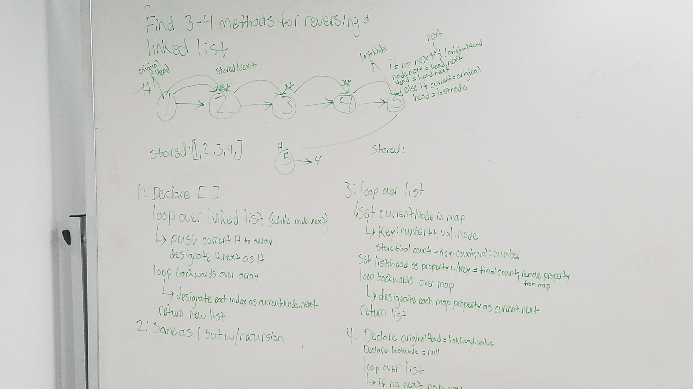

# Linked List Reversals and Balanced Binary tree 

This is for two separate tasks:
1. Write at least three different function for reversing a linked list
2. Write a function that returns true if a binary tree is balanced and false if not

## Running the tests

##### Balanced Binary Tree:
1. Testing to ensure function returns true on a balanced tree
2. Testing to ensure function returns false on an unbalanced tree
3. Testing to ensure function returns undefined on empty tree

##### Linked list reversal:
Note: These tests are currently failing and I'm still trying to find a way to write them that works.

#### To run all tests:
```
npm run test
```


